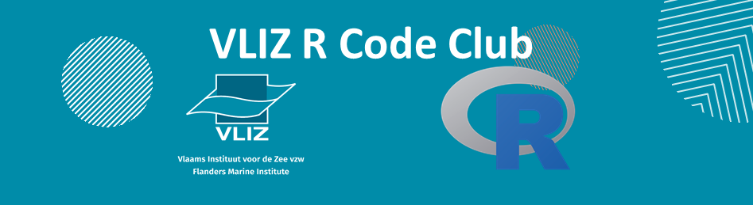

---
output:
  rmarkdown::html_document:
        theme: yeti # darkly

    
---

```{r setup, include=FALSE}
library(knitr)
opts_chunk$set(echo = FALSE)
setwd("H:/Rcodeclub_mails/Session 6")
perc_img <- "80%"
```


```{r, out.width = "100%", fig.align = "center"}

```

### **Title**

#### *date*

dummy text. look at me I am writting right now

&nbsp;

***

### **Innovation Challenge in Ocean Plastic**


&nbsp;

### **Sea Invaders! - Open Sea Lab Hackaton**


&nbsp;


### **Tracking the users of VLIZ data systems**


&nbsp;

### **Writing reports with R Markdown**


&nbsp;

***
<center>
#### *What's next on the menu?*
</center>

 This and more topics will be discussed the next 2019-10-18 at 14:00 CET in the [meeting room IODE TR1](https://goo.gl/maps/84nY6un5qGDyv3Mr9)

```{r map, out.width = '100%', out.height= 250}
library(leaflet)
leaflet(width = "100%") %>%
  addTiles %>%
  setView(lng = 2.930397, lat = 51.232782, zoom = 16) %>%
  addMarkers(lng = 2.930397, lat = 51.232782, popup = "Meeting room IODE TR1")
```

**Projects**
  
  * *Tracking the users of VLIZ data systems*
  
**Training**
  
  * *How to put your personal Shiny app online*
  * *Best practices maintaining Shiny apps on VLIZ server*
  * *How to add a Shiny app to your website*
  * *Using R for [connecting to a database](https://db.rstudio.com/) and password security*
  * *Data wrangling with [dplyr](https://dplyr.tidyverse.org/)*
  
**Tips & Tricks**

  * *Create reproducible examples with [reprex](https://reprex.tidyverse.org)*
  * *Read the source R code with [lookup](https://www.rdocumentation.org/packages/qdapTools/versions/1.3.3/topics/lookup)*


***

<center>
*Want to know more? Send an email to rcodeclub@vliz.be, join the mailing list in rcodeclub-subscribe@vliz.be or just ask any of us during coffee breaks!*
&nbsp;

```{r, out.width = perc_img, fig.align = "center",fig.cap = "Hands up everyone who wants to join the R Code Club!"}

```
</center>
&nbsp;
&nbsp;
