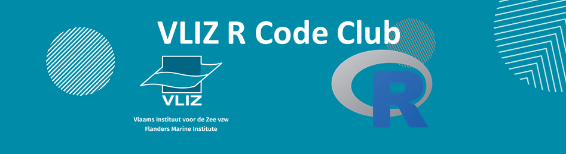

---
output:
  rmarkdown::html_document:
        theme: yeti # darkly

    
---

```{r setup, include=FALSE}
library(knitr)
opts_chunk$set(echo = FALSE)
# setwd("H:/Rcodeclub_mails/Session 6")
perc_img <- "80%"
```


```{r, out.width = "100%", fig.align = "center"}

```

### **Session 7**

This is the start of newsletter 7

#### *2019-10-18*

The R code club keeps growing! This time we were twelve R nerds who ganged up together to share what were the latest issues that we solved using the statistical programming language. Grab a coffee and keep reading!

&nbsp;

***

### **Measuring the citation impact of our data systems**

Since last month we started a series of regular meetings to brainstorm on developing an application that keeps track of the citations of systems hosted at VLIZ. For example, [WoRMS](http://www.marinespecies.org/) or [MarineRegions](http://www.marineregions.org/). We had colleagues from different departments involved: library, data centre or policy.

This application will be developed in RShiny, using gitlab as the version control system. We are currently looking at the capabilities of different packages working with citation and academic research.

We created a [gitlab repository for the citation app](https://gitlab.vliz.be/datac/rshiny/citation-impact), check it out!

&nbsp;

### **How to make your own shiny app**

Despite unfortunately our colleague Jonas Mortelmans couldn't assist, he prepared some slides explaining the logic behind a shiny app. In a nutshell, The output of a shiny app is reactive and depends on the input of the user. This part is edited in the User Interface side of the app, while the transformations run in the Server.

These shiny apps can be uploaded to shinyapps.io for free up to 25h a month. There is an example of Jonas: the [ScioMapper](https://sciomyzidae.shinyapps.io/sciomapper/)! More examples can be found in the [shiny-examples package](https://github.com/rstudio/shiny-examples).


&nbsp;


### **Making a clean reproducible example**

There is a tidyverse package to create reproducible examples named [reprex](https://reprex.tidyverse.org/). This is a great way to ask for help when you get stuck while coding.

&nbsp;

### **Best practices maintaining Shiny apps on VLIZ server**

There are certain practices we should follow when working in a project like the mentioned citation shiny app. Our colleague Paul from the IT department gave us a fun lecture about [version control](https://en.wikipedia.org/wiki/Version_control) in software development. Open sources systems like [Git](https://git-scm.com/) allows to keep track of all the changes that happened within your project. This repository is also a great way of working within a team, and it can be used as a backup. All advantages!


&nbsp;

### **R Code Club Newsletter**

The R Code Club newsletter is being written using RMarkdown. This framework allow to create documents using both the markdown writing syntax and code chunks (and not only R! Also SQL, Python...). The RMarkdown projects can be exported as a word document, pdf (using LaTeX) or as an html file. 

Inside the [R Code Club github repository](https://github.com/vlizBE/R-Code-Club) you can find this newsletter. Feel free to have a look and play around!

&nbsp;

***
<center>
#### *What's next on the menu?*
</center>

These and more topics will be discussed the next 2019-11-08 at 14:00 CET in the [meeting room Marmara](https://goo.gl/maps/84nY6un5qGDyv3Mr9)

```{r map, out.width = '100%', out.height= 250}
library(leaflet)
leaflet(width = "100%") %>%
  addTiles() %>%
  setView(lng = 2.930397, lat = 51.232782, zoom = 16) %>%
  addMarkers(lng = 2.930397, lat = 51.232782, popup = "Meeting room IODE TR1")
```

**Projects**
  
  * *Citation impact shiny app*
  
**Training**
  
  * *Data wrangling with dplyr*
  * *Warming Stripes in R*
  * *Tidy Tuesdays*
  * *R Code Club internship*

***

<center>
*Want to know more? Send an email to rcodeclub@vliz.be, join the mailing list in rcodeclub-subscribe@vliz.be or visit the [R Code Club github repository](https://github.com/vlizBE/R-Code-Club).*
&nbsp;

```{r, out.width = perc_img, fig.align = "center",fig.cap = ""}
# 
```
</center>
&nbsp;
&nbsp;
