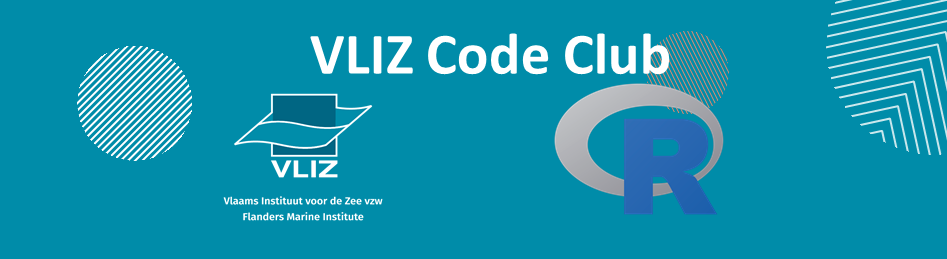

---
output:
  rmarkdown::html_document:
        theme: yeti # darkly

    
---

```{r setup, include=FALSE, }
library(knitr)
opts_chunk$set(echo = FALSE)
# setwd("H:/Rcodeclub_mails/Session 6")
perc_img <- "80%"
library(dplyr)
library(kableExtra)
library(emo)
```


```{r, out.width = "100%", fig.align = "center"}

```

### **Session 8**

<!-- <<<<<<< HEAD

=======
This is the start of newsletter 7
>>>>>>> a93b95ac80487b7ae36fb509afee0877ebcc933a -->

#### *2019-12-06*

Were you worried about the next monthly R Code Club newsletter? You can breath again, here it is! Let's have a look at what did the Vlizers do with R lately.
&nbsp;

***

### **citation impact app**

No new meetings, jelle will send an email. it is on hold.

### **Open science workflows**

it is to make your science more open and not only your final publication. Make your data and analysis open for reproducibility

Shared data gets more citations.

An obligation in some cases

Some journals ask to open your data

European open science cloud

--
Jan reubens

European tracking network

Git: 

-- lennert

Use binder: it launches the environment you used for your analysis
mybinder.org

We should send an email about who wants to discuss on best practices on organizing data repositories within vliz


&nbsp;

### **Imis explorer**

Imis have some holes in the metadata or open science

The tool allows to explore the contect of IMIS and find error -> unresolved urls.

It is a tool for internal use to fill the gaps of imis. It can be used some features in imis 

&nbsp;


### **d**

&nbsp;

### **d** 


***
<center>
#### *What's next on the menu?*
</center>

These and more topics will be discussed the next 2020-01-?? at 14:00 CET in the [meeting room Marmara](https://goo.gl/maps/84nY6un5qGDyv3Mr9)

```{r map, out.width = '100%', out.height= 250, eval=FALSE}
# Something went wrong, it doesnt knit. Possible overlapping with another package.
library(leaflet)
leaflet(width = "100%") %>%
  addTiles() %>%
  setView(lng = 2.930397, lat = 51.232782, zoom = 16) %>%
  addMarkers(lng = 2.930397, lat = 51.232782, popup = "Meeting room IODE TR1")
```

**Projects**
  
  * *D*
  * *P*
  
**Training**
  
  * *Ee*
  * *k*
  * *;*
  * *k *

***

<center>
*Want to know more? Send an email to rcodeclub@vliz.be, join the mailing list in rcodeclub-subscribe@vliz.be or visit the [R Code Club github repository](https://github.com/vlizBE/R-Code-Club).*
&nbsp;

```{r, out.width = perc_img, fig.align = "center",fig.cap = ""}
# 
```
</center>


&nbsp;
&nbsp;
